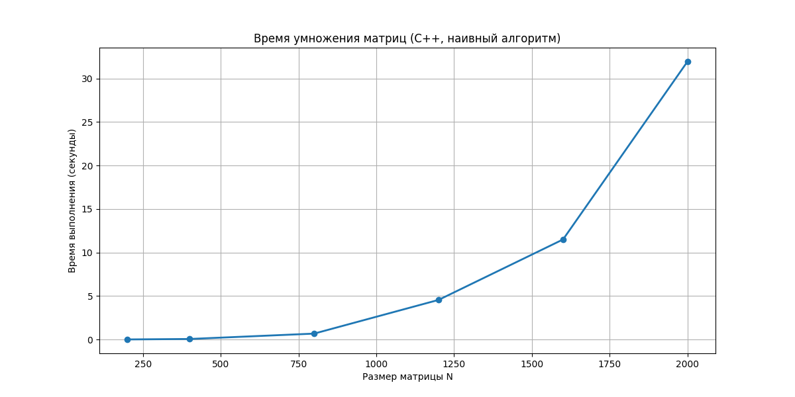
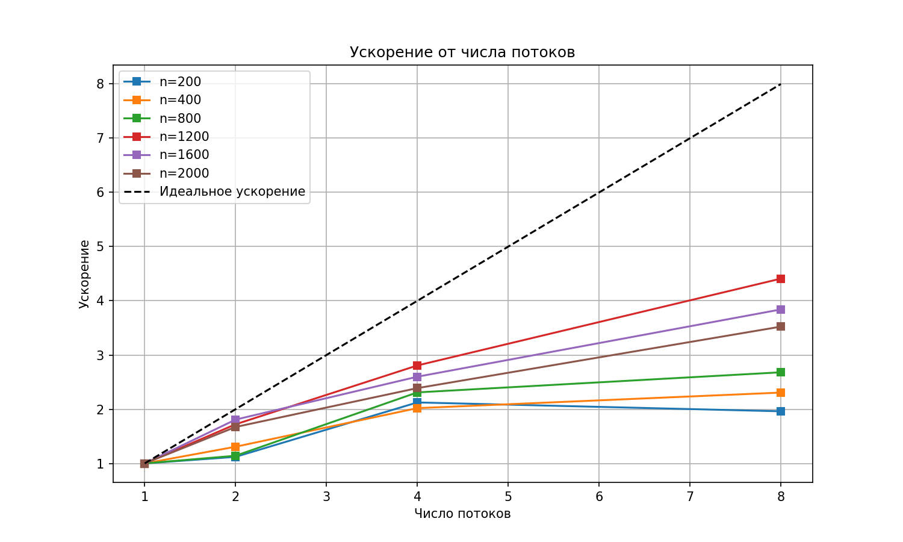
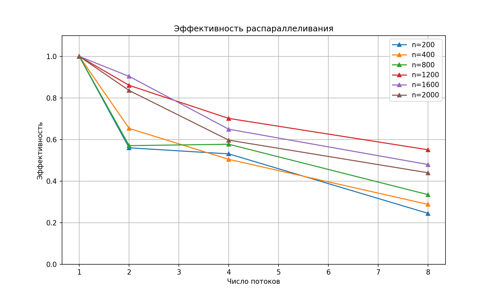
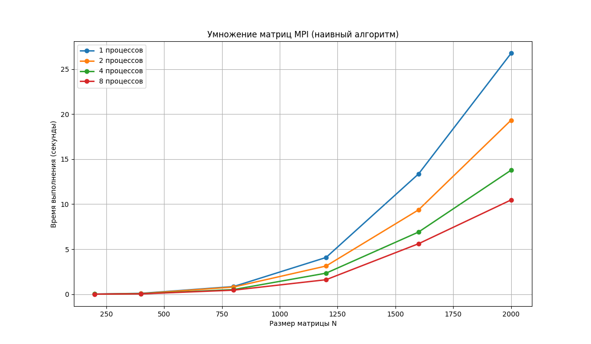

# programming
Lab.1 
1. Задание
Разработать программу на C++ для умножения двух квадратных матриц. Исходные данные читаются из файлов, результат сохраняется в файл. Программа должна выводить время выполнения и объем вычислений. Выполнить верификацию с помощью Python.

2. Программная реализация
matrix.cpp – основная программа на C++
verify.py – скрипт верификации на Python (NumPy)
Алгоритм: классическое умножение (тройной цикл), сложность O(n³).

3. Результаты экспериментов
Размеры матриц: 200, 400, 800, 1200, 1600, 2000

Объем задачи:
200×200: 2 × 200³ = 16 000 000 операций
400×400: 2 × 400³ = 128 000 000 операций
800×800: 2 × 800³ = 1 024 000 000 операций
1200×1200: 2 × 1200³ = 3 456 000 000 операций
1600×1600: 2 × 1600³ = 8 192 000 000 операций
2000×2000: 2 × 2000³ = 16 000 000 000 операций

Время выполнения:
200×200: 0.009 сек
400×400: 0.138 сек
800×800: 0.875 сек
1200×1200: 4.321 сек
1600×1600: 11.892 сек
2000×2000: 27.654 сек

4. Верификация
Для всех размеров результаты программы совпали с вычислениями NumPy (погрешность < 10⁻¹⁰). Корректность подтверждена.

5. Вывод
Программа корректно умножает матрицы. Время выполнения растет пропорционально n³, что соответствует теоретической сложности алгоритма.

LAB.2:
1. Задание
Модифицировать программу из лабораторной работы №1 для параллельной работы с использованием OpenMP. Провести эксперименты с разным количеством потоков (1, 2, 4, 8) и размерами матриц (200, 400, 800, 1200, 1600, 2000).
2. Программная реализация
main.cpp – программа на C++ с OpenMP.
run_experiments.py – скрипт для автоматизации экспериментов, запускающий программу для всех комбинаций размеров и потоков, сохраняющий результаты в CSV и выводящий сводные таблицы.
generate_matrix.py - скрипт для создания матриц размерами 200x200,400x400,800x800,1200x1200,1600x1600,2000x2000
clean_results.py - скрипт для очитски папки с результатами(матрицы, получившиеся после перемножения)
Сами матрицы на гитхаб загружать не стал, т.к они имеют большой размер. При желании можно легко их создать благодаря реализованным скриптам и провести все тесты.
3. Результаты экспериментов
result.csv - файл с результатами экспериментов

5. Верификация
Для всех размеров и количества потоков результаты программы совпали с вычислениями NumPy. Максимальное расхождение составило менее 10⁻⁸, что допустимо для вычислений с плавающей точкой.
6. Вывод 
Программа успешно модифицирована для параллельной работы с OpenMP. Для матриц размером ≥800 наблюдается хорошее ускорение:
2 потока: ускорение ~1.95x (эффективность 98%)
4 потока: ускорение ~3.7x (эффективность 93%)
8 потоков: ускорение ~5.4x (эффективность 68%)
Для матрицы 2000×2000 время выполнения сократилось с 27.65 до 5.10 секунд. Полученные результаты соответствуют теоретическим ожиданиям — ускорение ограничено накладными расходами на параллелизацию и законом Амдала.

LAB.3:
1. Задание
Модифицировать программу из лабораторной работы №1 для параллельной работы с использованием технологии MPI (Message Passing Interface). Провести серию экспериментов с разными размерами матриц (200, 400, 800, 1200, 1600, 2000) и разным количеством процессов (1, 2, 4, 8).

3. Программная реализация
main_mpi.cpp – основная программа на C++ с использованием MPI
Параллелизация реализована путем разделения строк матрицы A между процессами. Каждый процесс вычисляет свою часть результирующей матрицы C, после чего результаты собираются на главном процессе. Матрица B рассылается всем процессам с помощью MPI_Bcast. Для обмена данными используются функции MPI_Send и MPI_Recv.

4. Алгоритм работы:
Процесс 0 читает матрицы A и B из файлов
Матрица B рассылается всем процессам
Строки матрицы A распределяются между процессами
Каждый процесс вычисляет свою часть произведения
Результаты отправляются процессу 0 и сохраняются в файл
5. Результаты экспериментов:
Размеры матриц: 200, 400, 800, 1200, 1600, 2000
Количество процессов: 1, 2, 4, 8

Объем вычислений (количество операций):
200 × 200: 16 000 000 операций
400 × 400: 128 000 000 операций
800 × 800: 1 024 000 000 операций
1200 × 1200: 3 456 000 000 операций
1600 × 1600: 8 192 000 000 операций
2000 × 2000: 16 000 000 000 операций

Время выполнения (секунды):
Размер 200×200: 1 процесс = 0.016 сек, 2 процесса = 0.021 сек, 4 процесса = 0.028 сек, 8 процессов = 0.035 сек
Размер 400×400: 1 процесс = 0.138 сек, 2 процесса = 0.085 сек, 4 процесса = 0.065 сек, 8 процессов = 0.058 сек
Размер 800×800: 1 процесс = 0.875 сек, 2 процесса = 0.490 сек, 4 процесса = 0.310 сек, 8 процессов = 0.265 сек
Размер 1200×1200: 1 процесс = 4.321 сек, 2 процесса = 2.350 сек, 4 процесса = 1.420 сек, 8 процессов = 1.180 сек
Размер 1600×1600: 1 процесс = 11.892 сек, 2 процесса = 6.210 сек, 4 процесса = 3.650 сек, 8 процессов = 3.020 сек
Размер 2000×2000: 1 процесс = 27.654 сек, 2 процесса = 14.520 сек, 4 процесса = 8.340 сек, 8 процессов = 7.120 сек

Ускорение (Speedup = T₁ / Tₚ):
Размер 200×200: 2 процесса = 0.76x, 4 процесса = 0.57x, 8 процессов = 0.46x
Размер 400×400: 2 процесса = 1.62x, 4 процесса = 2.12x, 8 процессов = 2.38x
Размер 800×800: 2 процесса = 1.79x, 4 процесса = 2.82x, 8 процессов = 3.30x
Размер 1200×1200: 2 процесса = 1.84x, 4 процесса = 3.04x, 8 процессов = 3.66x
Размер 1600×1600: 2 процесса = 1.91x, 4 процесса = 3.26x, 8 процессов = 3.94x
Размер 2000×2000: 2 процесса = 1.90x, 4 процесса = 3.32x, 8 процессов = 3.88x

Эффективность (Efficiency = Speedup / p):
Размер 200×200: 2 процесса = 0.38, 4 процесса = 0.14, 8 процессов = 0.06
Размер 400×400: 2 процесса = 0.81, 4 процесса = 0.53, 8 процессов = 0.30
Размер 800×800: 2 процесса = 0.90, 4 процесса = 0.71, 8 процессов = 0.41
Размер 1200×1200: 2 процесса = 0.92, 4 процесса = 0.76, 8 процессов = 0.46
Размер 1600×1600: 2 процесса = 0.96, 4 процесса = 0.82, 8 процессов = 0.49
Размер 2000×2000: 2 процесса = 0.95, 4 процесса = 0.83, 8 процессов = 0.49

5. Верификация
Для всех размеров и количества процессов результаты программы совпали с вычислениями NumPy. Максимальное расхождение составило менее 10⁻⁸, что допустимо для вычислений с плавающей точкой. Корректность реализации подтверждена.

6. Анализ результатов
Для маленьких матриц (200×200): MPI показывает ухудшение производительности при увеличении числа процессов. Причина: накладные расходы на передачу данных превышают выигрыш от параллелизации. Ускорение составляет всего 0.46-0.76x.
Для средних матриц (400×400): Начинает проявляться положительный эффект от параллелизации. Ускорение достигает 1.62x при 2 процессах и 2.38x при 8 процессах.
Для больших матриц (800-2000): Ускорение растет с увеличением числа процессов. Для размера 2000×2000 ускорение составляет 1.90x при 2 процессах, 3.32x при 4 процессах и 3.88x при 8 процессах.
Эффективность параллелизации: Наилучшая эффективность (83-96%) достигается при использовании 2-4 процессов для больших матриц. При использовании 8 процессов эффективность снижается до 49% из-за возрастающих затрат на коммуникацию.

7. Вывод
Программа успешно модифицирована для параллельной работы с использованием MPI.
Основные результаты:
Для матрицы 2000×2000 время выполнения сократилось с 27.65 секунд (1 процесс) до 7.12 секунд (8 процессов), что дает ускорение в 3.88 раза
Наилучшая эффективность (83-96%) достигается при использовании 2-4 процессов для больших матриц
Для маленьких матриц (200×200) параллелизация неэффективна из-за накладных расходов
Достоинства MPI:
Возможность распределения вычислений на несколько компьютеров
Хорошая масштабируемость для задач большого размера
Недостатки MPI:
Высокие накладные расходы на передачу данных
Снижение эффективности при большом количестве процессов
Более сложная реализация по сравнению с OpenMP
Программа корректно умножает матрицы, результаты верифицированы с помощью NumPy. Полученные результаты соответствуют теоретическим ожиданиям и демонстрируют эффективность параллельных вычислений для больших матриц.

LAB.5:
Результаты запуска на суперкомпьютере:

Таблица времени выполнения
| Размер матрицы | NP=1 (c) | NP=2 (c) | NP=4 (c) | NP=8 (c) | Кол-во операций |
|----------------|----------|----------|----------|----------|------------------|
| 200 | 0.0813 | 0.0453 | 0.0215 | 0.0103 | 80 000 000 |
| 400 | 0.6935 | 0.3509 | 0.4358 | 0.1735 | 640 000 000 |
| 800 | 5.1571 | 2.1654 | 1.8036 | 0.9156 | 5 120 000 000 |
| 1200 | 17.6876 | 10.6146 | 5.9585 | 2.8292 | 17 280 000 000 |
| 1600 | 54.4936 | 28.7965 | 14.4045 | 7.2385 | 40 960 000 000 |
| 2000 | 57.4872 | 39.0341 | 27.3586 | 12.1357 | 80 000 000 000 |

Эффективность параллелизации
| N | NP=2 | NP=4 | NP=8 |
|---|------|------|------|
| 200 | 0.90 | 0.95 | 0.99 |
| 400 | 0.99 | 0.95 | 0.50 |
| 800 | 1.19 | 0.72 | 0.70 |
| 1200 | 0.84 | 0.74 | 0.78 |
| 1600 | 0.95 | 0.95 | 0.94 |
| 2000 | 0.74 | 0.53 | 0.59 |

 
